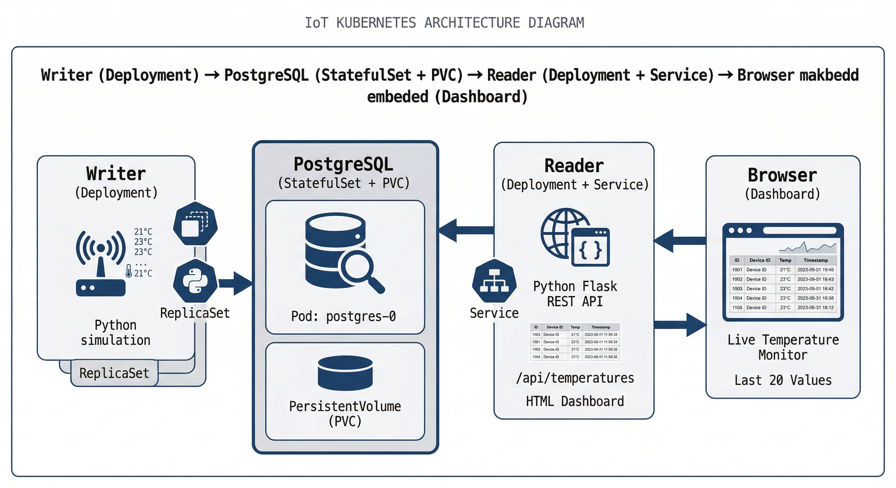

# IoT System on Kubernetes

Cloud Computing project implementing a simple IoT architecture deployed on Kubernetes.

The system simulates IoT temperature sensors (Writer) that store data in a PostgreSQL database.
A Reader microservice exposes a REST API to retrieve temperature values.

## Architecture

The system is composed of:

- **Writer**: simulates IoT devices generating temperature data.
- **PostgreSQL (StatefulSet)**: stores temperature values.
- **Reader**: REST API that retrieves stored temperatures.
- **Kubernetes Services**: internal communication and load balancing.

## Architecture Diagram

## Kubernetes Features Demonstrated

- Deployments
- StatefulSet (PostgreSQL)
- Services
- Namespace isolation
- Horizontal scaling
- Self-healing (automatic pod recreation)
- Resource monitoring (metrics-server)
- Persistent storage
- ConfigMap (database initialization via init.sql)
- Secret (database credentials)

## How to Run

1. Start Minikube:
   minikube start

2. Apply Kubernetes manifests:
   kubectl apply -f k8s/

3. Access the application:
   kubectl port-forward service/reader-service 5000:5000 -n iot-project

For detailed step-by-step instructions, see `Command.md`.

## Web Dashboard

The Reader microservice provides:

- `/` → HTML dashboard (table view)
- `/api/temperatures` → REST endpoint returning JSON data

The dashboard displays the latest 20 temperature values stored in PostgreSQL.

Each row contains:

- ID
- Device ID
- Temperature value
- Timestamp

To access the system:

1. Start the cluster and deploy all components.
2. Run:

   kubectl port-forward service/reader-service 5000:5000 -n iot-project

3. Open:

   http://localhost:5000

The table updates dynamically using data retrieved from the `/api/temperatures` endpoint.

## Non-Functional Aspects

The project demonstrates the following non-functional properties:

- **Scalability**: Reader and Writer can be scaled horizontally.
- **High Availability**: Multiple replicas ensure service continuity.
- **Self-Healing**: Failed pods are automatically recreated.
- **Monitoring**: CPU and memory usage can be observed via metrics-server.
- **Data Persistence**: PostgreSQL retains data after pod restart.

## Kubernetes Resources Used

- Deployment (Writer, Reader)
- StatefulSet (PostgreSQL)
- Service (internal communication)
- PersistentVolume & PersistentVolumeClaim
- ConfigMap (database initialization)
- Secret (database credentials)
- Namespace (iot-project)

## Technologies

- Kubernetes (container orchestration)
- Docker (containerization)
- Minikube (local Kubernetes cluster)
- Python (Flask for REST API and dashboard)
- PostgreSQL (relational database)